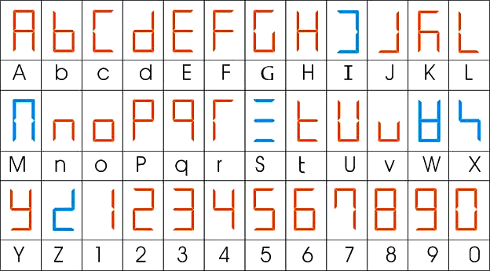
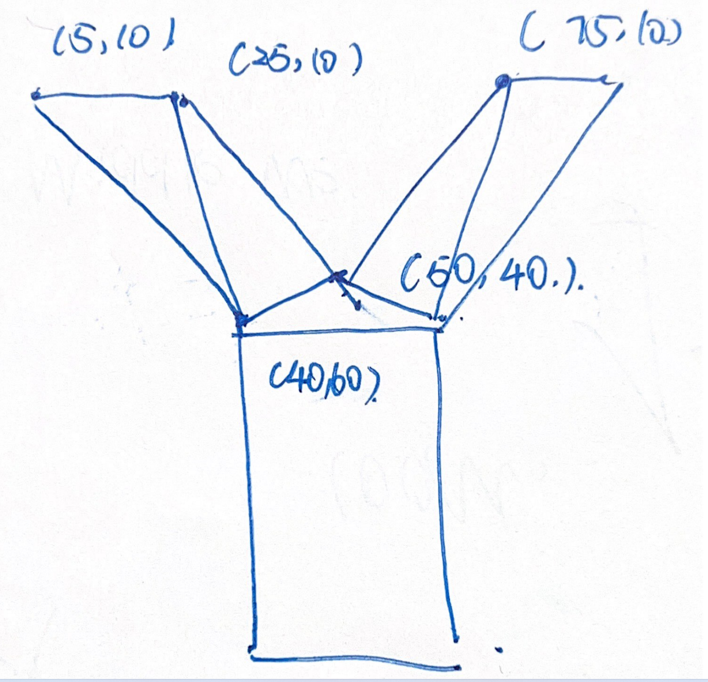
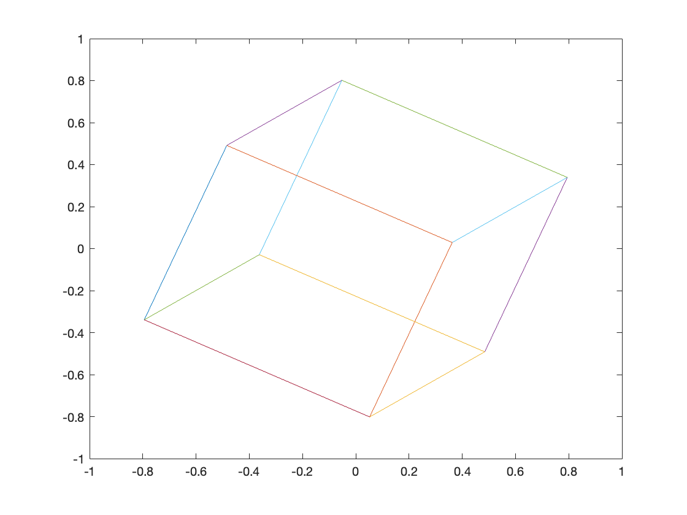

# Problems about GitHub Version Control
First of All, I am extremely sorry that during the early stage of code development, I did not use the GitHud to do the version control. Because I did not find the relavant GitHub Link to this project. So I used **Gitee** because I am more familar with **Gitee**, this is a similar tool as Github. I am extremely sorry that I submitted the code together to GitHub in the end development cycle.

# Abstract
This report introduces a music player based on DE1-SoC. LCD LT24 is applied to show the album picture, the ralavant LT24 graphic library is developed. Including draw **Line**, **Rectangle**, **Triangle**, **Bit Map ASCII Text** and **Vector Text**.

# Introduction
In this project, Audio Out port is applied generate audio signal, ARM A9 Private Timer is applied to achieve the auto fresh function of LCD, seven segment LED displays are applied to indicate the function number, pushbuttons for interact with the functions.[1]

# Specification of the Programm

## Seven Segment Display

The seven segment displays are applied to indicate the number of the function. Display number 0-1 display the serial number of function. Display number 2-5 display the alphabet of "FUNC" means the word function. 

<div align=center></div>

<div align=center><text>Figure 1. 7 Segment Display Alphabet Layout [2]</text></div>

## Pushbutton Keys and Programm Function Introduction
Pushbutton is used to interact with the programm.
### Function 1 Draw Vector Text
| Pushbutton Key   | Function  |
|  ----  | ----  |
| <kbd>KEY0</kbd>   | Zoom In|
| <kbd>KEY1</kbd>   | Zoom Out|
| <kbd>KEY3</kbd>   | Generate Random Colour|
| <kbd>KEY4</kbd>   | Next Function|
<div align=center><text>Table 1. Pushbutton Keys Functions in Function 1.</text></div>

### Function 2 Draw Line
| Pushbutton Key   | Function  |
|  ----  | ----  |
| <kbd>KEY0</kbd>   | Generate Random Position for (x1,y1)|
| <kbd>KEY1</kbd>   | Generate Random Position for (x2,y2)|
| <kbd>KEY3</kbd>   | Generate Random Colour|
| <kbd>KEY4</kbd>   | Next Function|
<div align=center><text>Table 2. Pushbutton Keys Functions in Function 2.</text></div>

### Function 3 Draw Rectangle
| Pushbutton Key   | Function  |
|  ----  | ----  |
| <kbd>KEY0</kbd>   | Generate Random Position for Base Point Position|
| <kbd>KEY1</kbd>   | Generate Random Size|
| <kbd>KEY3</kbd>   | Generate Random Colour|
| <kbd>KEY4</kbd>   | Next Function|
<div align=center><text>Table 3. Pushbutton Keys Functions in Function 3.</text></div>

### Function 4 Draw Triangle
| Pushbutton Key   | Function  |
|  ----  | ----  |
| <kbd>KEY0</kbd>   | Generate Random Position for (x1,y1)|
| <kbd>KEY1</kbd>   | Generate Random Position for (x2,y2)|
| <kbd>KEY3</kbd>   | Generate Random Position for (x3,y3)|
| <kbd>KEY4</kbd>   | Next Function|
<div align=center><text>Table 4. Pushbutton Keys Functions in Function 4.</text></div>

### Function 5 Draw Bit Map Text
| Pushbutton Key   | Function  |
|  ----  | ----  |
| <kbd>KEY0</kbd>   | Generate Random Position for Base Point Position|
| <kbd>KEY1</kbd>   | Generate Random Text|
| <kbd>KEY3</kbd>   | Generate Random Colour|
| <kbd>KEY4</kbd>   | Next Function|
<div align=center><text>Table 5. Pushbutton Keys Functions in Function 5.</text></div>

### Function 6 Play Music
Push button is disabled to promise the stability of the programm

# Code Structure

This programm is achieved by Interrupt. There are two interrupts in this programm.

# Important Global Variable

| Variable Name   | Position | Function |
| :--: | :--: | -- |
|     `unsigned short My_Test[76800]`       | DDR3 | Frame Buffer or VRAM |

<div align=center><text>Table 6. Important Global Variables.</text></div>

## `main` 
Initialize the ralavant functions and periphals.

## `timerISR` 

ARM A9 Private Time is applied to generate interrupt once a second. 

If the interrupt does not occur, the processor is put to sleep to save power.
| Timer|  Clock Source Frequency(MHz)| Prescale|Load Value|Period|Frequency
|  ----  | :--:  | :--: | :--: | :--: | :--: |
| ARM A9 Private Timer | 225 | 224(+1) | 1000000 | 1Second | 1Hz |


<div align=center><text>Table 7. ARM A9 Private Timer.</text></div>

When this interrupt happens, load the value in `My_Test` to update the LCD pixels.

## `pushbuttonISR` 

`pushbuttonISR` handles the pushbuttons input and main logic of the whole programm. When KEY3 is pressed, the programm will switch to another function.

## `Audio_Out`

`Audio_Out` exibit the album picture of the song and play the song untill it end.

## `My_LT24_copyFrameBuffer`

This is function is applied to write the value in VRAM or frame buffer to the display pixel bu pixel.

## `Change_FrameBuffer_Pixel`
This function is applied to change a signle pixel in the frame buffer.

## `FrameBuffer_Clear`
This function is applied to change all of the pixels to a certain colour in the frame buffer.

## `FramBuffer_DrawLine`
This function is applied to draw a line between (x1,y1) and (x2,y2) using brehenham algorithm.

Bresenham's line algorithm is one of the most important algorithms in computer graphics. On paper, given an arbitrary start and end point, it is very simple to draw a line connecting them: you may just need to connect them with a ruler; however, to render a line on a computer screen is a little more complicated.

Given two points: the starting point (x1, y1) and the ending point (x2, y2), the theoretical line connecting them can be described by the quadratic equation y=mx+b, specifying that m within [0,1] and that the line is a line pointing to the first quadrant. 

So we can think of the k-value here as an increment, past the midpoint, we can y+1. So the first time we can go and compare it to the midpoint, when x moves one frame, the y direction moves by a corresponding k-value and the increment accumulates by the corresponding k-value when (d>0.5) our y moves up when (d<0.5) the y does not move up and when the y moves up by one frame it is higher than the original one, for example Now k=0.4: the first time we move d+=0.4, d<0.5, y does not move up the second time we move d+=0.4=0.8, d>0.5, y moves up by one frame. [3]


## `FramBuffer_DrawRectangle`

This function can draw and fill a rectangle, by repeating draw line via `FramBuffer_DrawLine` pixel by pixel.

## `FramBuffer_DrawTriangle`

This function can draw and fill a triangle, by drawing Lines between a corner of a triangle with the pixels on its diagonal. Repeat this procedure for all of the corner. 

## `FrameBuffer_DrawText`

This function use the ASCII bit map to draw text in the frame buffer. The bitmap is referencing [3].

## `FrameBuffer_DrawH`

This function can draw vector text **H** by dividing the text into three rectangles. This vector font is designed by my ownself.

## `FrameBuffer_DrawY`

This function can draw vector text **Y** by dividing the text into one rectangle and five triangles. This vector font is designed by my ownself.

<div align=center></div>

<div align=center><text>Figure 2. Self Font Design</text></div>

# Code Debugging

A funny stuff is that, when I used this device to play the music, but the software usually crashed after play the music for a couple of seconds. I don't know what's the problem with the software. Finally I found out that, I forgot to add `HPS_ResetWatchdog();` in the cycle.

Actually it took me a long time to finished the `FramBuffer_DrawLine`, I tried to used mathmetical formular like `y = k*x + b`to calculate the pixel number of the lines. But it was more complicated, and the calculation take very long time. So I serached on the **Bresenham Alorithms**. I tried to finishe the algorithms directly via C language, however I cannot make any progress. After using MATLAB to do the simulattion, the coding process is much more easier.

Another problem is around drawing and filling triangle, I found it diffcult to find the pixels inside a triangle. So I though I could fill all the pixels inside the triangle by connecting the pixels around the borderlines, and I found it useful.

Actually, I tried to make some 3D animation on the LCD, but I stucked on the matrix multiplication, and still not finished yet. I've finished the principle algorithms on MATLAB, it is extremely difficul to implement these code.

<div align=center></div>

<div align=center><text>Figure 3. MATLAB Code Simulation</text></div>

```MATLAB
clear all
close all
relative_points = [0 0 0; 0 0 1; 0 1 0; 0 1 1; 1 0 0; 1 0 1; 1 1 0; 1 1 1]-[0.5 0.5 0.5];

position = [0 0 4];

for i=1:1000

rotation = [2*i/1000*pi 2*i/1000*pi 2*i/1000*pi];

rz = [cos(rotation(3)) -sin(rotation(3)) 0; sin(rotation(3)) cos(rotation(3)) 0; 0 0 1];

ry = [1 0 0; 0 cos(rotation(2)) -sin(rotation(2)) ; 0 sin(rotation(2))  cos(rotation(2))];

rz = [cos(rotation(1)) 0 sin(rotation(1)); 0 1 0; -sin(rotation(1)) 0 cos(rotation(1))];

rotation = rz*ry*rz;

actual_position = relative_points*rotation+position;

plot([actual_position(1,1) actual_position(2,1)],[actual_position(1,2) actual_position(2,2)])
hold
plot([actual_position(1,1) actual_position(3,1)],[actual_position(1,2) actual_position(3,2)])
plot([actual_position(1,1) actual_position(5,1)],[actual_position(1,2) actual_position(5,2)])
plot([actual_position(8,1) actual_position(4,1)],[actual_position(8,2) actual_position(4,2)])
plot([actual_position(8,1) actual_position(7,1)],[actual_position(8,2) actual_position(7,2)])
plot([actual_position(8,1) actual_position(6,1)],[actual_position(8,2) actual_position(6,2)])
plot([actual_position(1,1) actual_position(2,1)],[actual_position(1,2) actual_position(2,2)])
plot([actual_position(2,1) actual_position(4,1)],[actual_position(2,2) actual_position(4,2)])
plot([actual_position(4,1) actual_position(3,1)],[actual_position(4,2) actual_position(3,2)])
plot([actual_position(5,1) actual_position(6,1)],[actual_position(5,2) actual_position(6,2)])
plot([actual_position(5,1) actual_position(7,1)],[actual_position(5,2) actual_position(7,2)])
plot([actual_position(6,1) actual_position(2,1)],[actual_position(6,2) actual_position(2,2)])
plot([actual_position(7,1) actual_position(3,1)],[actual_position(7,2) actual_position(3,2)])
xlim([-1 1])
ylim([-1 1])
pause(0.02)
end
```

Another problems is that the programm usually crashed when debugging in the interuupt, I do know why.


# Hardware Testing
Not only I followed my code rule and instruction testing the system, I also tried to press the pushbutton irrelevantly and randomly for long time or short time to check whether the programm will be crashed or not.

# Conclusions

## Results Analysis
This project is fished as expected, but there are still some drawbacks, I did not finished the 3D animation. I will regret it. Another problems is that I did not use the GitHub to manage this project. 

I did not finished all of the graphic library, especially for the round.

I just made two vector letter functions, "H" and "Y". Even just for these two letters, it took me a long time to design the letter, so of courese I did not do this process for all the letters.

Another problem is that I am not very familar with GUI development, so the interface is a kind of ugly, I need to study more in this field.

# Reference

[1] DE1-SoC Computer System with ARM Cortex-A9

[2] https://www.sohu.com/a/367282904_100281310

[3] https://blog.csdn.net/l59565455/article/details/87458261

[4] https://www.qdtech.net

# Appendix

The source code for `Test.c`, `Syphony.c` and  `XYSheldon.c` is not included in the appendix, because they are too long. The Visual Studio Code will carsh if I paste these file here.

## `main.c`

```C

#include "DE1SoC_LT24/DE1SoC_LT24.h"
#include "DE1SoC_WM8731/DE1SoC_WM8731.h"
#include "My_LCD.h"
#include "My_Driver/Audio_Out.h"
#include "HPS_Watchdog/HPS_Watchdog.h"
#include "HPS_IRQ/HPS_IRQ.h"
#include "HPS_usleep/HPS_usleep.h"
#include "DE1SoC_SevenSeg/DE1SoC_SevenSeg.h"
#include "global.h"
#include <math.h>
#include "Test.h"
#include <stdlib.h>

volatile unsigned int * Private_timer_ptr   = (unsigned int *) 0xFFFEC600;
volatile unsigned int * KEY_ptr       = (unsigned int *) 0xFF200050;

unsigned int MODE;
double ampl;
unsigned int counter;

//Vector Font Parameters
int fontsize = 60;
int fontcolour = 0XFFFF;
//Draw Line Parameters
unsigned int Linex1 = 1;
unsigned int Liney1 = 1;
unsigned int Linex2 = 240;
unsigned int Liney2 = 320;
unsigned int Linecolour = 0xFFFF;
//Draw Rectangle Parameters
unsigned int recx1 = 10;
unsigned int recy1 = 10;
unsigned int recw = 120;
unsigned int rech = 120;
unsigned int reccolour = 0xFFFF;
//Draw Triangle Parameters
unsigned int Trianglex1 = 120;
unsigned int Triangley1 = 20;
unsigned int Trianglex2 = 60;
unsigned int Triangley2 = 200;
unsigned int Trianglex3 = 180;
unsigned int Triangley3 = 200;
//Draw Text Parameters
unsigned int Textx = 120;
unsigned int Texty = 160;
unsigned int Textnumber = 20;
unsigned int Textcolour = 0xFFFF;


void exitOnFail(signed int status, signed int successStatus){
    if (status != successStatus) {
        exit((int)status); //Add breakpoint here to catch failure
    }
}

void pushbuttonISR(HPSIRQSource interruptID, bool isInit, void* initParams) {
    if (!isInit)
    {
    	// Get the button number being pushed.
        unsigned int press;
        press = KEY_ptr[3];
        //switch to another function
        if (press == 0x08)
        {
        	MODE = MODE+1;
        	if (MODE ==6)
        	{
        		DE1SoC_SevenSeg_SetDoubleDec(0x00,MODE);
        		//Disable Timer to disable LCD auto fresh
        		Private_timer_ptr[2] = 0x00;
        		Audio_Out();
        	}

        	if (MODE ==7)
        	{
        		MODE = 1;
        		//Enable Timer to enable LCD auto fresh
        		Private_timer_ptr[2] = 0xE007;
        	}
        }
        //Indicate the MODE number in the 7 segment display
        DE1SoC_SevenSeg_SetDoubleDec(0x00,MODE);
        //Vector Text
        if (MODE == 1)
        {
            if (press==0x01)
            {
            	// Make the text larger
            	fontsize = fontsize * 1.2;
            }
            else if (press==0x02)
            {
            	// Make the text smaller
            	fontsize = fontsize * 0.8;
            }
            else if (press==0x04)
            {
            	// Generate random colour
            	fontcolour = rand()%31+rand()%63*32+rand()%31*2048;
            }
        	FrameBuffer_Clear(0);

        	FrameBuffer_DrawH(100, 0,fontsize, fontcolour);
        	FrameBuffer_DrawY(100, 100, fontsize,fontcolour);
			FrameBuffer_DrawH(100, 200,fontsize, fontcolour);
        }
        //Draw Line
        if (MODE ==2)
        {
            if (press==0x01)
            {
            	// Generate random position for (x1,y1)
            	Linex1 = rand()%240;
            	Liney1 = rand()%320;
            }
            else if (press==0x02)
            {
            	// Generate random position for (x2,y2)
            	Linex2 = rand()%240;
            	Liney2 = rand()%320;
            }
            else if (press==0x04)
            {
            	// Generate random colour for line
            	Linecolour = rand()%31+rand()%63*32+rand()%31*2048;
            }
        	FrameBuffer_Clear(0);
        	FramBuffer_DrawLine(Linex1,Liney1,Linex2,Liney2,Linecolour);
        	FramBuffer_DrawLine(1,160,240,160,0xFFFF);
        	FramBuffer_DrawLine(120,1,120,320,0xFFFF);
        }
        //Draw Rectangle
        if (MODE ==3)
        {
            if (press==0x01)
            {
            	// Generate random position
            	recx1 = rand()%100;
            	recy1 = rand()%100;
            }
            else if (press==0x02)
            {
            	// Generate random size
            	recw = rand()%100;
            	rech = rand()%100;
            }
            else if (press==0x04)
            {
            	// Generate random colour
            	reccolour = rand()%31+rand()%63*32+rand()%31*2048;
            }
        	FrameBuffer_Clear(0);
        	FramBuffer_DrawRectangle(recx1,recy1,recw,rech,reccolour);

        }
        //Draw Triangle
        if (MODE ==4)
        {
            if (press==0x01)
            {
            	// Generate random position for (x1,y1)
            	Trianglex1 = rand()%240;
            	Triangley1 = rand()%320;
            }
            else if (press==0x02)
            {
            	// Generate random position for (x2,y2)
            	Trianglex2 = rand()%240;
            	Triangley2 = rand()%320;
            }
            else if (press==0x04)
            {
            	// Generate random position for (x3,y3)
            	Trianglex3 = rand()%240;
            	Triangley3 = rand()%320;
            }
        	FrameBuffer_Clear(0);
        	FramBuffer_DrawTriangle(Trianglex1,Triangley1,Trianglex2,Triangley2,Trianglex3,Triangley3,0xFFFF);
        }
        //Draw ASCII 1608 Text
        if (MODE ==5)
        {
        	FrameBuffer_Clear(0);
            if (press==0x01)
            {
            	Textx = rand()%180+20;
            	Texty = rand()%280+20;
            }
            else if (press==0x02)
            {
            	Textnumber = rand()%93+1;
            }
            else if (press==0x04)
            {
            	Textcolour = rand()%31+rand()%63*32+rand()%31*2048;
            }
        	FrameBuffer_DrawText(Textx,Texty,Textnumber,Textcolour);
        }
        // Clear the Pushbutton Interrupt Flag
        KEY_ptr[3] = press;
    }
    HPS_ResetWatchdog();
}

void timerISR(HPSIRQSource interruptID, bool isInit, void* initParams)
{
	// Fresh the LCD
	LT24_copyFrameBuffer(My_Test,0,0,240,320);
	// Clear the Timer Interrupt Flag
    if (!isInit) {
    	Private_timer_ptr[3] |= 0x01;
    }
    HPS_ResetWatchdog();
}

int main(void) {
    signed int audio_sample = 0;
    volatile unsigned char* fifospace_ptr;
    volatile unsigned int*  audio_left_ptr;
    volatile unsigned int*  audio_right_ptr;
    volatile unsigned int * LEDR_ptr = (unsigned int *)0xFF200000;

    //Initialise the LCD Display.
    exitOnFail(
            LT24_initialise(0xFF200060,0xFF200080), //Initialise LCD
            LT24_SUCCESS);                          //Exit if not successful
    HPS_ResetWatchdog();

    //Initialise IRQs
    HPS_IRQ_initialise(NULL);
    HPS_ResetWatchdog();

    // Set Private_timer
    // Set the timer period
    // period = 225/(225 MHz) x (1000000) = 1 sec
    // Refresh Rate = 1Hz
    Private_timer_ptr[0] = 1000000;

    // Write to control register to auto reload and interrupt function
    // Set the prescaler value 224
    Private_timer_ptr[2]   = 0xE007;//Start timer

    KEY_ptr[2] = 0x0F;// Enable interrupts for all four KEYs
    HPS_ResetWatchdog();

    // Register interrupt handler for timerISR
    HPS_IRQ_registerHandler(IRQ_MPCORE_PRIVATE_TIMER, timerISR);
    HPS_ResetWatchdog();

    // Register interrupt handler for keys
    HPS_IRQ_registerHandler(IRQ_LSC_KEYS, pushbuttonISR);
    HPS_ResetWatchdog();

    // Default MODE is 1
    MODE = 1;

    //Initialise the Audio Codec.The DAC initialization code is based on the given example
    exitOnFail(
            WM8731_initialise(0xFF203040),  //Initialise Audio Codec
            WM8731_SUCCESS);                //Exit if not successful
    //Clear both FIFOs
    WM8731_clearFIFO(true,true);
    //Grab the FIFO Space and Audio Channel Pointers
    fifospace_ptr = WM8731_getFIFOSpacePtr();
    audio_left_ptr = WM8731_getLeftFIFOPtr();
    audio_right_ptr = WM8731_getRightFIFOPtr();
    //Initialise Phase Accumulator
    ampl  = 1;

    // Clear the periphals
    DE1SoC_SevenSeg_Clear();
    LEDR_ptr[0] = 0x00;
    FrameBuffer_Clear(0);

    // Display text "FUNC" + MODE number
    DE1SoC_SevenSeg_Write(5,0x71);
    DE1SoC_SevenSeg_Write(4,0x3E);
    DE1SoC_SevenSeg_Write(3,0x54);
    DE1SoC_SevenSeg_Write(2,0x39);
    DE1SoC_SevenSeg_SetDoubleDec(0x00,MODE);

    FrameBuffer_DrawH(100, 0,fontsize, fontcolour);
    FrameBuffer_DrawY(100, 100, fontsize,fontcolour);
    FrameBuffer_DrawH(100, 200,fontsize, fontcolour);

    while(1) {
    	__asm("WFI");
        HPS_ResetWatchdog();
    }
}
```

## `global.h`
```C
/*
 * global.h
 *
 *  Created on: Mar 31, 2022
 *      Author: Neowless
 */

#ifndef GLOBAL_H_
#define GLOBAL_H_

extern unsigned int MODE;

extern double ampl;

extern unsigned int counter;

#endif /* GLOBAL_H_ */

```

## `My-LCD.c`
```C

#include "DE1SoC_LT24/DE1SoC_LT24.h"
#include "My_LCD.h"
#include "Test.h"
#include "HPS_Watchdog/HPS_Watchdog.h"
#include "HPS_usleep/HPS_usleep.h" //some useful delay routines


signed int My_LT24_copyFrameBuffer(unsigned short* framebuffer, unsigned int xleft, unsigned int ytop, unsigned int width, unsigned int height)
{
	// Baseed on the example code
    unsigned int cnt;
    signed int status = LT24_setWindow(xleft,ytop,width,height);
    if (status != LT24_SUCCESS) return status;
    cnt = (height * width);
    while (cnt--) {
        LT24_write(true, *framebuffer++);
    }
    return LT24_SUCCESS;
}

void Change_FrameBuffer_Pixel(int x, int y, unsigned short colour)
{
	if(x<240&&y<320&&x>0&&y>0)
	{
		My_Test[y*240+x] = colour;
	}

}

void FrameBuffer_Clear(unsigned short colour)
{
	// Change all the Pixels
    int i;
	for(i = 0; i<76800; i++)
	{
		My_Test[i] = colour;
	}
}


void FramBuffer_DrawLine(unsigned int x1, unsigned int y1, unsigned int x2, unsigned int y2, unsigned short colour)
{
	// Bresenham Algorithm is modified from (https://blog.csdn.net/l59565455/article/details/87458261)
	int x = x1;
	int y = y1;
	int dx = abs(x2 - x1);
	int dy = abs(y2 - y1);
	int s1 = x2 > x1 ? 1 : -1;
	int s2 = y2 > y1 ? 1 : -1;
	int p = 2 * dy - dx;
	int i;
	char interchange = 0;
	if (dy > dx)
	{
		int temp = dx;
		dx = dy;
		dy = temp;
		interchange = 1;
	}
	for(i = 0; i < dx; i++)
	{
		Change_FrameBuffer_Pixel(x, y, colour);
		if (p >= 0)
		{
			if (!interchange)
				y += s2;
			else
				x += s1;
			p -= 2 * dx;
		}
		if (!interchange)
			x += s1;
		else
			y += s2;
		p += 2 * dy;
	}
}

void FramBuffer_DrawRectangle(unsigned int x, unsigned int y, unsigned int w, unsigned int h, unsigned short colour)
{
	// Draw Vertical Lines
	int i;
	int j;
	for(j = 0; j < h; j++)
	{
		for(i = 0; i < w; i++)
			{
				Change_FrameBuffer_Pixel(x+i, y+j, colour);
			}
	}
}


void FramBuffer_DrawSubTriangle(unsigned int x1, unsigned int y1, unsigned int x2, unsigned int y2, unsigned int x3, unsigned int y3, unsigned short colour)
{
	// Draw Lines between a corner of a triangle with the pixels on its diagonal.
	int x = x1;
	int y = y1;
	int dx = abs(x2 - x1);
	int dy = abs(y2 - y1);
	int s1 = x2 > x1 ? 1 : -1;
	int s2 = y2 > y1 ? 1 : -1;
	int p = 2 * dy - dx;
	int i;
	char interchange = 0;
	if (dy > dx)
	{
		int temp = dx;
		dx = dy;
		dy = temp;
		interchange = 1;
	}
	for(i = 0; i < dx; i++)
	{
		FramBuffer_DrawLine(x, y, x3, y3, colour);
		if (p >= 0)
		{
			if (!interchange)
				y += s2;
			else
				x += s1;
			p -= 2 * dx;
		}
		if (!interchange)
			x += s1;
		else
			y += s2;
		p += 2 * dy;
	}
}

void FramBuffer_DrawTriangle(unsigned int x1, unsigned int y1, unsigned int x2, unsigned int y2, unsigned int x3, unsigned int y3, unsigned short colour)
{
	// Draw all of the corners
	// Draw Lines between a corner of a triangle with the pixels on its diagonal.
	FramBuffer_DrawSubTriangle(x1,y1,x2,y2,x3,y3,colour);
	FramBuffer_DrawSubTriangle(x1,y1,x3,y3,x2,y2,colour);
	FramBuffer_DrawSubTriangle(x3,y3,x2,y2,x1,y1,colour);
}

void FrameBuffer_DrawText(unsigned int x, unsigned int y,unsigned int fontnumber, unsigned short colour)
{
	// The ASCII bitmap of the text is based on (www.qdtech.net)
	int i;
	int j;
	for(i = 0;i<16;i++)
	{
		for(j = 0;j<8;j++)
		{
			if((font1608[fontnumber][i]>>(8-j))&0x01)
			{
				My_Test[(x-j)+(y+i)*240] = colour;
			}

		}
	}
}


void FrameBuffer_DrawH(unsigned int hx, unsigned int hy, unsigned int fontsize, unsigned int fontcolour)
{
	// Draw a vector "H"
	FramBuffer_DrawRectangle(hx+fontsize*15/100,hy+fontsize*5/100,fontsize*0.2,fontsize*0.9,fontcolour);
	FramBuffer_DrawRectangle(hx+fontsize*15/100,hy+fontsize*40/100,fontsize*0.7,fontsize*0.2,fontcolour);
	FramBuffer_DrawRectangle(hx+fontsize*65/100,hy+fontsize*5/100,fontsize*0.2,fontsize*0.9,fontcolour);
}

void FrameBuffer_DrawY(unsigned int yx, unsigned int yy, unsigned int fontsize, unsigned int fontcolour)
{
	// Draw a vector "Y"
	FramBuffer_DrawTriangle(yx+fontsize*5/100,yy+fontsize*10/100,yx+fontsize*25/100,yy+fontsize*10/100,yx+fontsize*40/100,yy+fontsize*60/100,fontcolour);
	FramBuffer_DrawTriangle(yx+fontsize*50/100,yy+fontsize*40/100,yx+fontsize*25/100,yy+fontsize*10/100,yx+fontsize*40/100,yy+fontsize*60/100,fontcolour);
	FramBuffer_DrawTriangle(yx+fontsize*50/100,yy+fontsize*40/100,yx+fontsize*60/100,yy+fontsize*60/100,yx+fontsize*40/100,yy+fontsize*60/100,fontcolour);
	FramBuffer_DrawTriangle(yx+fontsize*50/100,yy+fontsize*40/100,yx+fontsize*60/100,yy+fontsize*60/100,yx+fontsize*75/100,yy+fontsize*10/100,fontcolour);
	FramBuffer_DrawTriangle(yx+fontsize*95/100,yy+fontsize*10/100,yx+fontsize*60/100,yy+fontsize*60/100,yx+fontsize*75/100,yy+fontsize*10/100,fontcolour);
	FramBuffer_DrawRectangle(yx+fontsize*40/100,yy+fontsize*60/100,fontsize*0.2,fontsize*0.55,fontcolour);
}

```

## `My-LCD.h`
```C


#ifndef MY_LCD
#define MY_LCD

//Include required header files
#include <stdbool.h> //Boolean variable type "bool" and "true"/"false" constants.

signed int My_LT24_copyFrameBuffer(unsigned short* framebuffer, unsigned int xleft, unsigned int ytop, unsigned int width, unsigned int height);

//Change a single Pixel in the LCD buffer
void Change_FrameBuffer_Pixel(int x, int y, unsigned short colour);

// Chaneg the LCD buffer to a certain value
void FrameBuffer_Clear(unsigned short colour);

// Draw a Line
void FramBuffer_DrawLine(unsigned int x1, unsigned int y1, unsigned int x2, unsigned int y2, unsigned short colour);

// Draw a Rectangle
void FramBuffer_DrawRectangle(unsigned int x, unsigned int y, unsigned int w, unsigned int h, unsigned short colour);

// Draw a ASCII text
void FrameBuffer_DrawText(unsigned int x, unsigned int y,unsigned int fontnumber, unsigned short colour);

// Draw a Triangle
void FramBuffer_DrawTriangle(unsigned int x1, unsigned int y1, unsigned int x2, unsigned int y2, unsigned int x3, unsigned int y3, unsigned short colour);
void FramBuffer_SubDrawTriangle(unsigned int x1, unsigned int y1, unsigned int x2, unsigned int y2, unsigned int x3, unsigned int y3, unsigned short colour);

// Draw a Vector Text
void FrameBuffer_DrawH(unsigned int hx, unsigned int hy, unsigned int fontsize, unsigned int fontcolour);
void FrameBuffer_DrawY(unsigned int yx, unsigned int yy, unsigned int fontsize, unsigned int fontcolour);

#endif /*DE1SoC_LT24_H_*/

```

## `Test.h`
```C
/* 
 * Test.h
 * 
 * An image of the DE1-SoC Board.
 */

#ifndef TEST_H_
#define TEST_H_

extern const unsigned short Test[76800];
extern unsigned short My_Test[76800];
extern unsigned int font1608[95][16];

extern const float Syphony[1571968];

#endif /* TEST_H_ */

```

## `My_Driver/Audio_Out.c`
```C
/*
 * Audio_Out.c
 *
 *  Created on: Mar 31, 2022
 *      Author: Neowless
 */

#include "Syphony.h"
#include "../global.h"
#include "DE1SoC_LT24/DE1SoC_LT24.h"
#include "DE1SoC_WM8731/DE1SoC_WM8731.h"
#include "../My_LCD.h"
#include "Audio_Out.h"
#include "HPS_Watchdog/HPS_Watchdog.h"
#include "HPS_IRQ/HPS_IRQ.h"
#include "HPS_usleep/HPS_usleep.h"
#include "../DE1SoC_SevenSeg/DE1SoC_SevenSeg.h"
#include "XYSheldon.h"


void Audio_Out()
{
	// The DAC initialization code is based on the given example
    volatile unsigned char* fifospace_ptr;
    volatile unsigned int*  audio_left_ptr;
    volatile unsigned int*  audio_right_ptr;
    signed int audio_sample = 0;
    exitOnFail(
            WM8731_initialise(0xFF203040),
            WM8731_SUCCESS);
    WM8731_clearFIFO(true,true);
    fifospace_ptr = WM8731_getFIFOSpacePtr();
    audio_left_ptr = WM8731_getLeftFIFOPtr();
    audio_right_ptr = WM8731_getRightFIFOPtr();


    // Display the Album Picture
    exitOnFail(
            LT24_copyFrameBuffer(XYSheldon,0,0,240,320),
            LT24_SUCCESS);

    ampl  = 2;
    counter =0;
    while (MODE==6) {
        if ((fifospace_ptr[2] > 0) && (fifospace_ptr[3] > 0))
        {
            audio_sample = ampl*Syphony[counter];
            // This song's name is “Huan Le Dou Di Zhu(Symphony)" created by XYSheldon. (https://music.163.com/#/song?id=424495239)
            // This song is authorized by XYSheldon for Yuheng Huo to use this song in ELEC5620M Mini Project.
            // The float number is generated form the lossless .wav file via  MATLAB
            *audio_left_ptr = audio_sample;
            *audio_right_ptr = audio_sample;
            counter++;
            if(counter==1571968)
            {
            	counter=0;
            	MODE = MODE+1;
            }
        }
        HPS_ResetWatchdog();
    }
}

```

## `My_Driver/Audio_Out.h`
```C
/*
 * Audio_Out.h
 *
 *  Created on: Mar 31, 2022
 *      Author: Neowless
 */

#ifndef MY_DRIVER_AUDIO_OUT_H_
#define MY_DRIVER_AUDIO_OUT_H_

#include <stdbool.h> //Boolean variable type "bool" and "true"/"false" constants.

void Audio_Out();

#endif /* MY_DRIVER_AUDIO_OUT_H_ */

```

## `My_Driver/Syphony.h`
```C
/*
 * Syphony.h
 *
 *  Created on: Mar 31, 2022
 *      Author: Neowless
 */

#ifndef MY_DRIVER_SYPHONY_H_
#define MY_DRIVER_SYPHONY_H_

extern const float Syphony[1571968];

#endif /* MY_DRIVER_SYPHONY_H_ */

```

## `My_Driver/XYSheldon.h`
```C
/*
 * XySheldon.h
 *
 *  Created on: Mar 31, 2022
 *      Author: Neowless
 */

#ifndef MY_DRIVER_XYSHELDON_H_
#define MY_DRIVER_XYSHELDON_H_

extern const unsigned short XYSheldon[76800];

#endif /* MY_DRIVER_XYSHELDON_H_ */

```

